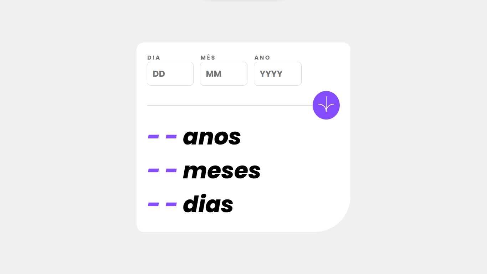
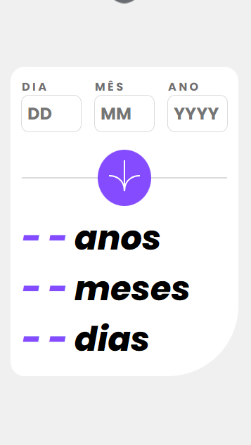

# Frontend Mentor - solução de aplicativo de calculadora de idade

Esta é uma solução para o [desafio do aplicativo de calculadora de idade no Frontend Mentor](https://www.frontendmentor.io/challenges/age-calculator-app-dF9DFFpj-Q). Os desafios do Frontend Mentor ajudam você a melhorar suas habilidades de codificação criando projetos realistas.

## Visão geral

### O desafio

Os usuários devem ser capazes de:

- Visualize a idade em anos, meses e dias após enviar uma data válida por meio do formulário
- Receber erros de validação se:
   - Qualquer campo está vazio quando o formulário é enviado
   - O número do dia não está entre 1-31
   - O número do mês não está entre 1-12
   - O ano está no futuro
   - A data é inválida, por ex. 31/04/1991 (abril tem 30 dias)
- Veja o layout ideal para a interface, dependendo do tamanho da tela do dispositivo
- Veja os estados de foco e foco para todos os elementos interativos na página
- 

### Capturas de tela

- 
- 

### Links
- URL do site ao vivo: [https://luckycarvalho.github.io/calculador-idade/](https://luckycarvalho.github.io/calculador-idade/)

## Meu processo

### Desenvolvimento contínuo

Neste projeto pude aprender muita coisa sobre JavaScript. Sinceramente tive bastantes dificuldades com o JS, apesar se ser um projeto relativamente simples. Porém, de modo geral pude desenvolver bastante minha lógica a respeito de validações dos formulários. Vou continuar postando mais projetos desse site, ele tem me ajudado muito. Sou grato a todos os desenvolvedores, obrigado!   

## Autor
- Desenvolvido por Matheus Carvalho.
